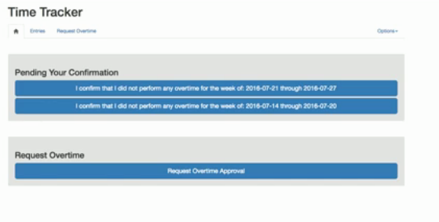
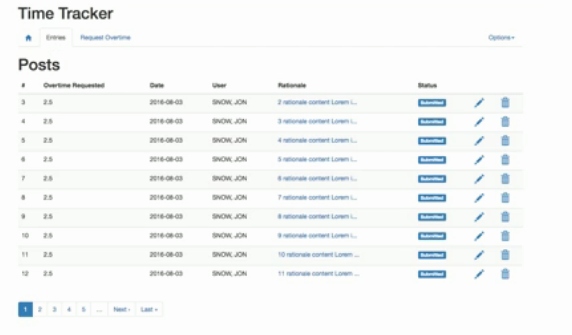
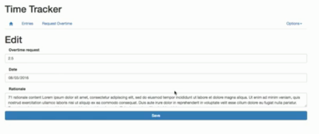
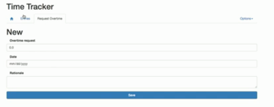
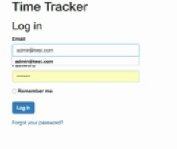
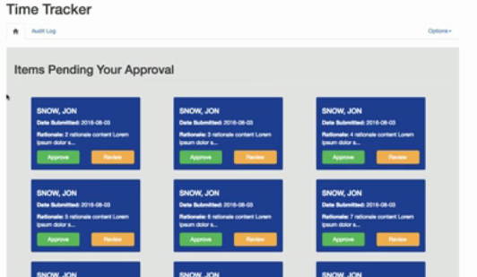
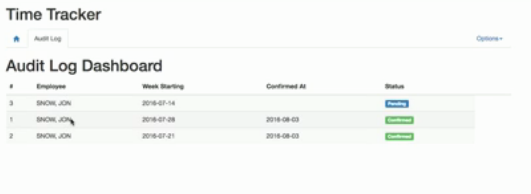
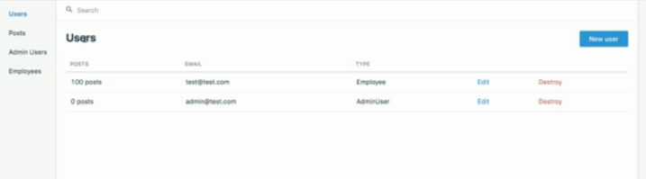

# Overtime app (comming Soon)

Rails app track if salaried employees did or did not get overtime each week.

As part of FSL, I have to complete a Rails training project, following a course from Udemy. This time the course [Professional Rails Code Along][udemy-course] is my target. Let's go for it!

This project should be a "real world Rails project using TDD/BDD", with professional features like:

- Using TDD and BDD with the RSpec and Capybara testing frameworks
- Working with the Twilio API to send SMS messages
- Integrating a permission structure for users
- Implementing an administrator dashboard
- Working with automated email components
- Creating an approval workflow from scratch
- Creating JavaScript Growl notifications
- And much more!

I will try to also infuse modern features and update the code as uch as possible.

## Desired State

At the end (when `dev` branch merges to `master`), we expect to have all the aforementioned features and to follow the original's designs:

I'll try to commit as much as possible, and to follow `gitflow`, so please check commits and branches.

> In branch dev you can find my latest code on this project!

## Author

<table style="width:100%">
<thead>
    <tr>
        <th align="center">
            <a href="https://israel-laguan.github.io" rel="nofollow">Israel Laguan</a>
        </th>
        <th align="center">
             

                 Email me to  <a href=”israellaguan@gmail.com”>israellaguan@gmail.com</a>
            

            

                
                Connect to<a href="https://www.linkedin.com/in/israellaguan">my Linkedin</a>   
            

        </th>
    </tr>
</thead>
  <tr>
    <td>
        

            
        

    </td>
    <td>
        

            
        

    </td>
  </tr>
</table>                                                          

## Contributing

[![contributions welcome][contributions-welcome]][issues-url]

🤝 Contributions, issues and feature requests are welcome!
Feel free to check the [issues page][issues-url].

## Show your support

🤗 Give a ⭐️ if you like this project!

## License

[![License][badge-apache]][apache-license]

📝 This project is licensed under the [Apache 2](LICENSE)\
Feel free to fork this project and improve it

[contributions-welcome]: https://img.shields.io/badge/contributions-welcome-brightgreen.svg?style=for-the-badge
[issues-url]: https://github.com/Israel-Laguan/overtime-app/issues
[badge-apache]: https://img.shields.io/badge/License-Apache%202.0-blue.svg?style=for-the-badge
[apache-license]: https://opensource.org/licenses/Apache-2.0
[author-pic]: https://avatars2.githubusercontent.com/u/36519478?s=460&v=4
[author-github]: https://israel-laguan.github.io
[author-linkedin]: https://www.linkedin.com/in/israellaguan
[author-email]: israellaguan@gmail.com
[linkedin-icon]: https://img.icons8.com/color/20/000000/linkedin.png
[email-icon]: https://img.icons8.com/color/20/000000/message-squared.png
[banner]: https://github.com/Israel-Laguan/Israel-Laguan/raw/master/docs/banner.jpg

[udemy-course]: https://www.udemy.com/course/professional-ruby-on-rails-coding-course/
